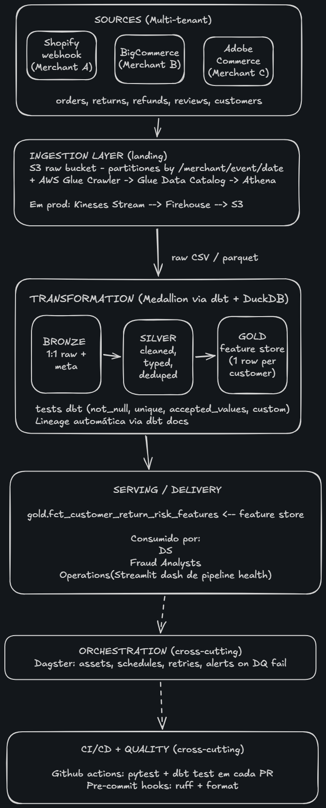
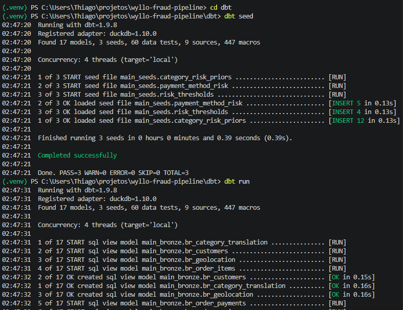
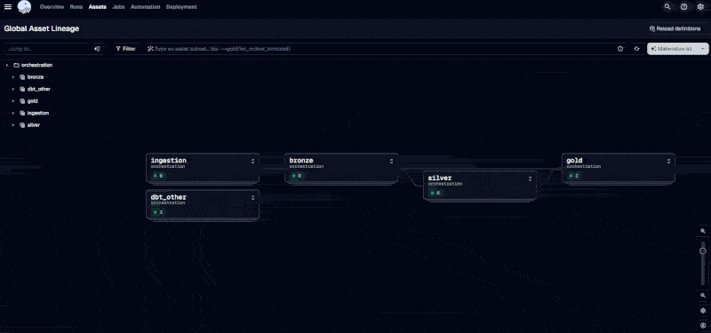

# Wyllo Return Fraud Pipeline

> End-to-end data engineering pipeline that turns raw e-commerce transactional
> data into a point-in-time feature store for return fraud and policy abuse
> detection. 

## Intro

Return fraud costs e-commerce ~$100B/year. **2% of customers cause 20% of
fraudulent returns** (NRF). The hard part isn't blocking — it's
**segmenting behaviour** so legitimate occasional-returners stay
unblocked. This pipeline produces the feature store that makes that
segmentation possible.

**As a Data Engineer:** We don't train the model. We deliver the
table where the decision becomes obvious.

```
                                         ┌───────────────────────────────────┐
Olist CSVs → S3 → Bronze → Silver → Gold │ fct_customer_return_risk_features │
                                         │ PK: (customer, snapshot_date)     │
                                         └─────────┬─────────────────────────┘
                                                   │
                              ┌────────────────────┼────────────────────┐
                              ▼                    ▼                    ▼
                       Data Scientist      Fraud Analyst        Pipeline Health
                       (trains models)    (writes rules)        (Streamlit + Plotly)
```

## Architecture



Full breakdown of layer responsibilities and tool-choice rationale in
[`docs/ARCHITECTURE.md`](docs/ARCHITECTURE.md).

## Pipeline running end-to-end

### dbt — 17 models, 60 tests, zero warnings

The Medallion pipeline materializing Bronze → Silver → Gold, followed
by the full test suite passing on real Olist data.



### Dagster — asset graph and orchestration

Auto-derived lineage from ingestion through the feature store. Each
dbt model becomes a Dagster asset; the graph mirrors the dbt manifest.



### Streamlit — pipeline health dashboard

Read-only view over the warehouse: row counts per layer, the feature
store contents, and the last dbt test results. Modelled on Monte Carlo
/ Elementary, not on a fraud-investigation tool.


---

## Status — what's built


🟢 Layer 0 — Schema mapping, architecture, repo scaffold
🟢 Layer 1 — Ingestion (CSVs → DuckDB + partitioned Parquet, S3-style layout)
🟢 Layer 2 — dbt Bronze / Silver / Gold (17 models, 60 tests passing)
🟢 Layer 3 — Dagster orchestration (29 assets, jobs, schedule, sensor)
🟢 Layer 4 — Streamlit pipeline-health dashboard


📝 Out of scope by design — documented in this README:


- AWS deployment (S3 / Glue / Athena scripts wired but not provisioned)
- RAG / AI catalog assistant (designed below)
- ML model training (Data Scientist's job — pipeline ends at feature store)


## Design documents (read these first)

- [`docs/SCHEMA_FRAUD_MAPPING.md`](docs/SCHEMA_FRAUD_MAPPING.md) — how
  Olist columns map to fraud-prevention features, with proxy logic and
  out-of-scope rationale.
- [`docs/ARCHITECTURE.md`](docs/ARCHITECTURE.md) — system design,
  layer responsibilities, tool-choice trade-offs, and the production
  migration path (Kinesis dashed box explained).

## Quick start — current state

```bash
# 1. Install Python deps (Python 3.11 or 3.12)
make install

# 2. Download the Olist dataset from Kaggle into data/raw/
make download-data

# 3. (next layer) Build Bronze/Silver/Gold
make dbt-run
```

The full one-command Docker setup ships with Layer 6.


## Tech choices in one line each

- **AWS S3 + Glue + Athena** — standard data lake; S3 as storage contract
- **DuckDB** — analytical engine, portable SQL (same models would run in
  Snowflake/BigQuery)
- **dbt** — SQL-as-code with tests, lineage, docs
- **Dagster** — asset-centric orchestrator that maps cleanly to dbt
- **Streamlit + Plotly** — pipeline health dashboard, not fraud dashboard
- **LangChain + FAISS** — small DataOps utility for catalog NL search
- **GitHub Actions** — CI runs dbt tests + pytest on every PR

Full rationale: see `docs/ARCHITECTURE.md`.

## Repository layout

\`\`\`
wyllo-fraud-pipeline/
├── ingestion/
│   ├── load_raw_to_duckdb.py   # The local-first loader (the one that runs)
│   ├── s3/                     # AWS S3 upload (wired, not deployed)
│   ├── glue/                   # AWS Glue crawler trigger
│   └── athena/                 # AWS Athena ad-hoc queries
├── dbt/
│   ├── models/
│   │   ├── bronze/             # 9 views, 1:1 raw + metadata
│   │   ├── silver/             # 6 tables, cleaned/typed/deduped
│   │   └── gold/               # int_orders_enriched + feature store
│   ├── seeds/                  # risk thresholds, category priors
│   ├── macros/                 # haversine, month_spine
│   └── tests/generic/          # custom expression_is_true, unique_combination
├── orchestration/              # Dagster — assets, jobs, schedule, sensor
├── streamlit/                  # Pipeline health dashboard
│   ├── app.py
│   ├── pages/                  # 4 pages: Layers, Feature Store, Quality, Lineage
│   └── utils/
├── docs/
│   ├── SCHEMA_FRAUD_MAPPING.md
│   ├── ARCHITECTURE.md
│   └── diagrams/               # Excalidraw + Dagster screenshots
└── .github/workflows/ci.yml
\`\`\`

## What this pipeline does NOT do (by design)

| Out of scope                        | Why                                                              |
|-------------------------------------|------------------------------------------------------------------|
| ML model training                   | Data Scientist's job. Pipeline produces the input.               |
| Rule engine business logic          | Fraud Analyst's job. Pipeline exposes features they query.       |
| Real-time pre-checkout scoring      | Sub-second latency need; this is the batch feature store.        |
| Cross-merchant identity resolution  | Wyllo's moat — requires data we don't have.                      |
| Device / IP fingerprint features    | Olist has none; simulation would be theater.                     |

These limits are interview discussion points, not failures.


## What I'd build next 

1. **AWS deployment** — provision S3 + Glue + Athena via Terraform, flip
   the dbt target from `local` to `prod`. The code is already wired.
2. **Catalog RAG assistant** — the FAISS + LangChain pipeline sketched
   below. ~1-2 days of work; the value would be analyst self-service over
   the dbt docs.
3. **Streaming ingestion path** — Kinesis Stream + Firehose → S3, to
   replace batch upload. The downstream code (dbt + Dagster) is already
   abstracted from this — only the entry path changes.
4. **Real-time scoring complement** — the current pipeline is the batch
   feature store. For pre-checkout (sub-second) decisions, I'd add a
   feature serving layer (Feast / Tecton / Redis) with selected features
   replicated from Gold.
5. **Identity resolution** — cluster customer_unique_id by behavioural
   similarity. Wyllo's competitive moat; would require multi-tenant data.
