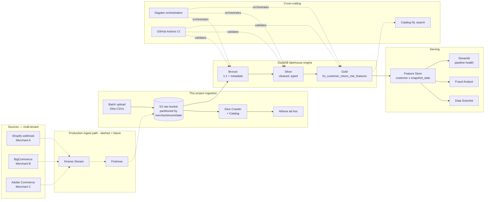

# Wyllo Fraud Pipeline — Architecture

## The problem

> Return fraud and policy abuse cost e-commerce merchants ~$100B/year
> globally (NRF, 2024). About 2% of customers are responsible for 20% of
> fraudulent returns. The challenge isn't binary blocking — it's
> **segmenting behaviour** so that aggressive abusers get caught while
> legitimate occasional-returners stay unblocked.

Wyllo (NoFraud + Yofi, post-October 2025 acquisition, rebranded March 2026)
is positioned as the first unified pre-checkout + post-checkout risk
intelligence platform for e-commerce. This pipeline demonstrates the
**data engineering** side of that proposition: turning raw transactional
events into a feature store that scoring models, fraud analysts, and
operations dashboards can all consume.

## High-level data flow



Dashed boxes/arrows = **production path** not implemented in this demo.
Solid = what runs today. See "Architectural decisions" below.

## Layer responsibilities

| Layer       | Tech                     | What it does                                                                | SLO target                  |
|-------------|--------------------------|-----------------------------------------------------------------------------|-----------------------------|
| Sources     | (simulated multi-tenant) | Land raw events from N merchant platforms                                   | n/a (driven by source)      |
| Ingestion   | boto3, S3, Glue, Athena  | Persist raw to S3 partitioned by `merchant_id/event_type/date`              | < 5 min for full load       |
| Bronze      | dbt + DuckDB (view)      | 1:1 mirror of sources + `_loaded_at`, `_source_file` metadata. 0 transforms.| 0 transformations           |
| Silver      | dbt + DuckDB (table)     | Typed, deduped, validated. dbt tests are the gate to Gold.                  | 100% tests pass to advance  |
| Gold        | dbt + DuckDB (table)     | `fct_customer_return_risk_features` — point-in-time feature store           | Refreshed each pipeline run |
| Serving     | DuckDB table             | Read endpoint for DS / analysts / dashboards                                | < 1s typical query          |
| Orchestration | Dagster                | Asset graph, schedules, retries, alerts on data-quality failure             | Backfill any single asset   |
| CI/CD       | GitHub Actions           | Run dbt tests + pytest on every PR. Block merge on red.                     | < 5 min full check          |
| Pipeline UI | Streamlit + Plotly       | Pipeline health: row counts, freshness, test pass rates, lineage view       | Loads in < 3s               |
| DataOps NL  | LangChain + FAISS        | Small utility — natural-language queries over the dbt catalog               | < 8s response (best-effort) |

## Architectural decisions and trade-offs

### Why S3 (and not Kinesis) as the entry point

In a production Wyllo deployment the ingestion path would be:

```
webhook → Kinesis Stream → Firehose → S3 → dbt
```

Kinesis handles transport (ordering, replay, throughput); Firehose batches
events into Parquet files of ~128MB on S3; S3 is the durable storage tier;
dbt + DuckDB consume from there. If volume scales to millions of events
per second, Kinesis is swapped for MSK (managed Kafka).

This project uses **S3 batch upload only**, because the Olist dataset is a
static CSV dump. Simulating Kinesis without real streaming volume would be
theater. Instead, the streaming layer is drawn as a dashed box in the
diagram to make the production architecture explicit.

**Migration path:** to ingest live Shopify webhooks tomorrow, the change
would be adding a Lambda → Kinesis Stream → Firehose → S3. Everything
downstream (Glue, dbt, DuckDB, Dagster) stays identical because **S3 is
the contract**.

### Why DuckDB (not Snowflake/BigQuery)

Pragmatic choice. DuckDB is an analytical engine that runs as a single
binary, reads Parquet from S3 natively via `httpfs`, and supports the same
ANSI SQL dbt would generate for Snowflake. This means:

- The demo runs on a laptop with no cloud spend.
- The dbt models are **portable**: switching to Snowflake means changing
  one `profiles.yml`, not rewriting SQL.

In production Wyllo with multi-tenant scale, Snowflake or BigQuery would
be the actual warehouse. The pipeline doesn't care.

### Why dbt

- SQL as versioned code.
- Tests as first-class citizens (`not_null`, `unique`, `accepted_values`,
  relationship tests, custom singular tests).
- Lineage graph generated automatically from `ref()` calls.
- Documentation generated from `schema.yml` files — these become the
  input to the catalog NL search utility.

Wyllo's data team publishes about dbt tests and DataOps culture publicly
(LinkedIn, André Brandão), so this choice signals cultural alignment.

### Why Dagster (not Airflow)

Dagster is **asset-centric** — it models the warehouse as a graph of
tables that should exist, and figures out what tasks to run to materialize
them. This maps perfectly to dbt's own model: each dbt model becomes a
Dagster asset, dependencies are inferred from `ref()`. Airflow would
require manually encoding the same DAG as task dependencies.

For a Medallion architecture especially, asset-centric thinking is the
right mental model: Bronze → Silver → Gold are sequenced asset layers,
not task sequences.

### Multi-tenant from day one — even with one dataset

Olist is one dataset, but partition keys throughout the pipeline include
`merchant_id`. This makes the architecture demonstrate multi-tenancy
even though the current data is single-tenant. Onboarding a second
merchant is a configuration change, not a refactor.

For the demo, each Olist `seller_id` is mapped to a synthetic
`merchant_id` to populate the partition.

### Snapshot-temporal feature store

The Gold feature store has grain `(customer_unique_id, snapshot_date)`,
not just `customer_unique_id`. This is point-in-time correctness — it
prevents data leakage if a downstream model is trained on the table, and
allows analysts to query "what did this customer look like on date X?"

This is the pattern used by Feast and Tecton in production. The price is
storage growth (1 row per customer per snapshot period) — but at our
scale, ~2.4M rows is trivial for DuckDB.

See `SCHEMA_FRAUD_MAPPING.md` Section 4 for the SQL implementation pattern.

## Failure handling

- Every dbt model has at least one test. If a test fails, Dagster marks
  downstream assets as `upstream_failed` and the dashboard shows red.
- Bronze materializes as `view`, so it always reflects current raw. Silver
  and Gold materialize as `table` — frozen between runs, eliminating
  read-during-write races.
- The catalog NL utility has a deterministic fallback: if FAISS retrieval
  returns nothing relevant, the response is "no matching documentation
  found" rather than a hallucinated SQL query.

## What's intentionally NOT in this pipeline

Documenting limits is engineering. These boundaries are explicit:

- **ML model training** — that's a Data Scientist's job. The pipeline
  ends at the feature store.
- **Rule engine business logic** — that's a Fraud Analyst's job. The
  pipeline exposes the features they query.
- **Real-time pre-checkout scoring** — Wyllo's pre-checkout product
  needs sub-second latency. This pipeline is the batch feature store
  that complements it, not replaces it.
- **Cross-merchant identity resolution** — Wyllo's moat. Requires data
  from multiple tenants that we don't have access to.
- **Device / IP fingerprint features** — Olist has none; simulation
  would degrade demo credibility more than it would add.

Each of the above is a conversation point, not an oversight.
